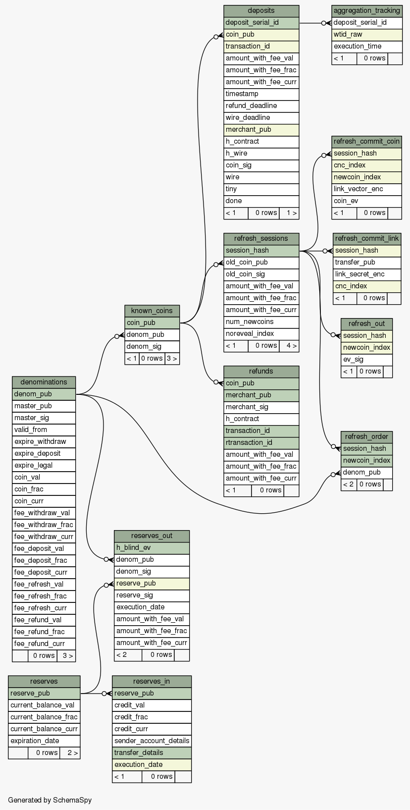

..
  This file is part of GNU TALER.
  Copyright (C) 2014, 2015, 2016 GNUnet e.V. and INRIA
  TALER is free software; you can redistribute it and/or modify it under the
  terms of the GNU General Public License as published by the Free Software
  Foundation; either version 2.1, or (at your option) any later version.
  TALER is distributed in the hope that it will be useful, but WITHOUT ANY
  WARRANTY; without even the implied warranty of MERCHANTABILITY or FITNESS FOR
  A PARTICULAR PURPOSE.  See the GNU Lesser General Public License for more details.
  You should have received a copy of the GNU Lesser General Public License along with
  TALER; see the file COPYING.  If not, see <http://www.gnu.org/licenses/>

  @author Christian Grothoff

======================
Operating the Exchange
======================

The following data and facilities have to be set up, in order to run an exchange:

* Keying
* Serving
* Currency
* Bank account
* Coins (= `denomination keys`)
* Database

In this document, we assume that ``$HOME/.config/taler.conf`` is being customized.

------
Keying
------

The exchange works with three types of keys:

* `master key`
* `sign keys`
* `denomination keys` (see section `Coins`)

`master key`: in section `[exchange]`, edit the two following values:

* `master_priv_file`: Path to the exchange's master private file.
* `master_public_key`: Must specify the exchange's master public key.

`sign keys` do not need any configuration.

-------
Serving
-------

The exchange can serve HTTP over both TCP and UNIX domain socket. It needs this
configuration *twice*, because it opens one connection for ordinary REST calls, and one
for "/admin" and "/test" REST calls, because the operator may want to restrict the access to "/admin".

The following values are to be configured under the section `[exchange]` and `[exchange-admin]`:

* `SERVE`: must be set to `tcp` to serve HTTP over TCP, or `unix` to serve HTTP over a UNIX domain socket
* `PORT`: set to the TCP port to listen on if `SERVE` is `tcp`.
* `UNIXPATH`: set to the UNIX domain socket path to listen on if `SERVE` is `unix`
* `UNIXPATH_MODE`: number giving the mode with the access permission mask for the `UNIXPATH` (i.e. 660 = rw-rw----).

The exchange can be started with the `-D` option to disable the administrative
functions entirely.  It is recommended that the administrative API is only
accessible via a properly protected UNIX domain socket.

--------
Currency
--------

The exchange supports only one currency. This data is set under the respective
option `currency` in section `[taler]`.

------------
Bank account
------------

The command line tool `taler-exchange-wire` is used to create a file with
the JSON response to /wire requests using the exchange's offline
master key.  The resulting file's path needs to be added to the configuration
under the respective option for the wire transfer method, i.e.
`sepa_response_file` in section `[exchange-wire-incoming-sepa]` when the
`wireformat` option in the configuration file allows `sepa` transactions. For example,
the utility may be invoked as follows::
  
  taler-exchange-wire -j '{"name": "The Exchange", "account_number": 10, "bank_uri": "https://bank.demo.taler.net", "type": "test"}' -t test -o exchange.json

Note that the value given to option `-t` must match the value in the JSON's field ``"type"``. `exchange.json` will be the same JSON given to ``-j`` plus the field
``"sig"``, which holds the signature of the JSON given in option ``-j`` made with exchange's master key. Finally, if `taler-exchange-wire` will not find any master
key at the location mentioned in `master_priv_file`, it will automatically generate (and use) one.

----------------------
Key Management Options
----------------------

The command line tool `taler-exchange-keyup` updates the signing key and list of denominations offered by the exchange.  This process requires the exchange's master key, and should be done offline in order to protect the master key.  For this, `taler-exchange-keyup` uses additional configuration options.

The section `[exchange_keys]` containts the following entries:

* `signkey_duration`: How long should one signing key be used?
* `lookahead_sign`:  For how far into the future should keys be issued?  This determines the frequency
  of offline signing with the master key.
* `lookahead_provide`: How far into the future should the exchange provide keys?  This determines the attack
  window on keys.

Sections specifying denomination (coin) information start with "coin\_".  By convention, the name continues with "$CURRENCY_[$SUBUNIT]_$VALUE", i.e. "[coin_eur_ct_10] for a 10 cent piece.  However, only the "coin\_" prefix is mandatory.  Each "coin\_"-section must then have the following options:

* `value`: How much is the coin worth, the format is CURRENCY:VALUE.FRACTION.  For example, a 10 cent piece is "EUR:0.10".
* `duration_withdraw`: How long can a coin of this type be withdrawn?  This limits the losses incured by the exchange when a denomination key is compromised.
* `duration_overlap`: What is the overlap of the withdrawal timespan for this coin type?
* `duration_spend`: How long is a coin of the given type valid?  Smaller values result in lower storage costs for the exchange.
* `fee_withdraw`: What does it cost to withdraw this coin? Specified using the same format as `value`.
* `fee_deposit`: What does it cost to deposit this coin? Specified using the same format as `value`.
* `fee_refresh`: What does it cost to refresh this coin? Specified using the same format as `value`.
* `rsa_keysize`: How many bits should the RSA modulus (product of the two primes) have for this type of coin.

------------------
Reserve management
------------------

Incoming transactions to the exchange's provider result in the creation or update of reserves, identified by their withdrawal key.

The command line tool `taler-exchange-reservemod` allows create and add money to reserves in the exchange's database.

-------------------
Database Scheme
-------------------

The exchange database must be initialized using `taler-exchange-dbinit`.  This
tool creates the tables required by the Taler exchange to operate.  The
tool also allows you to reset the Taler exchange database, which is useful
for test cases but should never be used in production.  Finally,
`taler-exchange-dbinit` has a function to garbage collect a database,
allowing administrators to purge records that are no longer required.

The database scheme used by the exchange look as follows:

------------------
Key Storage Format
------------------

The exchange's key directory contains the two subdirectories `signkeys` and `coinkeys`.

The directory `signkeys` contains signkey files, where the name is the start date of the respective key.

The `coinkeys` directory additionaly contains a subdirectory for each coin type alias.  These contain coinkey files, where the name is again the start timestamp of the respective key.
