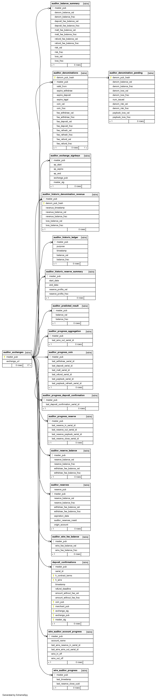

..
  This file is part of GNU TALER.

  Copyright (C) 2019-2020 Taler Systems SA

  TALER is free software; you can redistribute it and/or modify it under the
  terms of the GNU General Public License as published by the Free Software
  Foundation; either version 2.1, or (at your option) any later version.

  TALER is distributed in the hope that it will be useful, but WITHOUT ANY
  WARRANTY; without even the implied warranty of MERCHANTABILITY or FITNESS FOR
  A PARTICULAR PURPOSE.  See the GNU General Public License for more details.

  You should have received a copy of the GNU General Public License along with
  TALER; see the file COPYING.  If not, see <http://www.gnu.org/licenses/>

  @author Christian Grothoff

GNU Taler Auditor Operator Manual
#################################

Introduction
============

This manual is an early draft that still needs significant editing work
to become readable.

About GNU Taler
---------------

GNU Taler is an open protocol for an electronic payment system with a
free software reference implementation. GNU Taler offers secure, fast
and easy payment processing using well understood cryptographic
techniques. GNU Taler allows customers to remain anonymous, while
ensuring that merchants can be held accountable by governments. Hence,
GNU Taler is compatible with anti-money-laundering (AML) and
know-your-customer (KYC) regulation, as well as data protection
regulation (such as GDPR).

About this manual
-----------------

This tutorial targets exchange operators, auditors and governments
who want to run the auditor to verify that a GNU Taler exchange is
operating correctly.

Organizational prerequisites
----------------------------

Operating a GNU Taler auditor means that you (henceforth: auditor) have a
business relationship with (or regulatory authority over) a GNU Taler exchange
operator (henceforth: exchange).  Your objective is to verify that the
exchange is operating correctly, and if not to alert the exchange, the
state or even the public about any missbehavior to limit financial losses
to other parties.

To perform this duty, you will need at least (read-only) access to the bank
transactions of the exchange, as well as a continuously synchronized replica
of the exchange's database.

For this, every auditor needs to operate a Postgres database.  The data
collected will include sensitive information about Taler users, including
withdrawals made by consumers and income received by merchants.  As a result,
the auditor is expected to provide high confidentiality for the database.  In
general, the auditor does not have to offer high-availability: the exchange
operator can continue operations without the auditor, and the auditor can
catch up with it later when the auditor's systems are restored. However, of
course any downtime would provide a window of opportunity for fraud and should
thus be minimized.  Finally, the auditor's copy of the exchange's database can
be useful as a backup to the exchange in case the exchange experiences a loss
of its own copies. Thus, business agreements between auditor and exchanges may
include availability requirements as well.

Then, with the software provided, auditors can verify the cryptographic proofs
collected by the exchange and detect if any improper bank transactions are
made.  There are additional tasks which an auditor should perform.  While this
manual only focuses on the audit of the exchange's database and wire transfers
with the existing tools, a proper auditor should also perform the following
tasks:

- security audit of the source code
- audit of the operational procedures of the exchange
- audit of the physical security of the deployment
- background check of the individuals operating the exchange
- verification that the exchange properly implements the /link protocol
  (feature yet to be implemented in common Taler wallets)
- verification that the exchange properly reports coins issued during
  the refresh protocol (by irregularly refreshing coins withdrawn by
  the auditor and comparing against the exchange's database --- the
  code required to support this is not yet implemented)

Architecture overview
---------------------

Taler is a pure payment system, not a new crypto-currency. As such, it
operates in a traditional banking context. In particular, this means that in
order to receive funds via Taler, the merchant must have a regular bank
account, and payments can be executed in ordinary currencies such as USD or
EUR. Similarly, the exchange must interact with a bank. The bank of the
exchange holds the exchange’s funds in an escrow account.  As a result,
exchanges operate in a regulated environment, and auditors provide a crucial
oversight function.

Auditors should generally be independent third parties that verify that the
exchange operates correctly.  However, an exchange is likely to also run the
auditing logic, as it is also used to calculate the exchange’s profits, risk
and liabilities.  Furthermore, it's usually a good idea to not only rely on
third parties to verify one's own work.

The Taler software stack for an auditor consists of the following
components:

-  DBMS
   Postgres
   The auditor requires a DBMS to stores a local copy of the transaction history for
   the Taler exchange, as well as for its own internal bookkeeping and checkpointing.
   The DBMS is assumed to be assure the auditor of the database invariants (foreign
   key, uniqueness, length restrictions).  Should the exported data from the exchange
   fail to be imported due to constraint violations, this is an immediate serious
   concern that must be addressed manually.  The software only verifies the content
   of a well-formed exchange database (well-formed with respect to SQL).
   For now, the GNU Taler reference implemenation
   only supports Postgres, but the code could be easily extended to
   support another DBMS.

-  The auditor Web service
   The auditor is expected to provide a public Web service. At this REST API,
   merchants can (probabilistically) provide deposit confirmations, allowing
   the auditor to detect if an exchange is underreporting deposits.

   In the future, the Web service should be extended to allow customers and
   merchants to automatically upload cryptographic proof of other violations
   of the specification by the exchange.  However, for now it is assumed that
   the respective cryptographic proofs are reported and verified manually ---
   as with a well-behaved exchange this should obviously be a rare event.

   The main binary of this component is the ``taler-auditor-httpd``.

-  The (main) auditor
   The main auditor logic checks the various signatures, totals up the
   amounts and checks for arithmetic inconsistencies. It also
   computes the expected bank balance, revenue and risk exposure of the
   exchange operator. The main script of this component is the ``taler-auditor``.
   This script invokes several helper binaries sequentially. Production
   users may want to modify the script to run those binaries in parallel,
   possibly using different privileges (as only the ``taler-helper-auditor-wire``
   needs access to the wire gateway).

   The ``taler-helper-auditor-wire`` auditor verifies that the bank
   transactions performed by the exchange
   were done properly.  This component must have access to the bank account
   of the exchange, as well as to a copy of the exchange's database.

   The ``taler-auditor`` script invokes the various helpers, each generating
   a JSON report. It then invokes the ``taler-helper-auditor-render.py``
   script to combine those JSON files with a Jinja2 template into a
   LaTeX report.  Finally, ``pdflatex`` is used to generate a PDF report.

   The resulting report includes performance data, reports on hard violations
   (resulting in financial losses) and reports on soft violations (such as the
   exchange not performing certain operations in a timely fashion).  The
   report also includes figures on the losses of violations. Careful reading
   of the report is required, as not every detail in the report is necessarily
   indicative of a problem.

Installation
============

Please install the following packages before proceeding with the
exchange compilation.

-  GNU autoconf >= 2.69

-  GNU automake >= 1.14

-  GNU libtool >= 2.4

-  GNU autopoint >= 0.19

-  GNU libltdl >= 2.4

-  GNU libunistring >= 0.9.3

-  libcurl >= 7.26 (or libgnurl >= 7.26)

-  GNU libmicrohttpd >= 0.9.59

-  GNU libgcrypt >= 1.6

-  libjansson >= 2.7

-  Postgres >= 9.6, including libpq

-  texlive-latex-extra

-  python3-jinja2

-  libgnunetutil (from Git)

-  GNU Taler exchange (from Git)

Except for the last two, these are available in most GNU/Linux
distributions and should just be installed using the respective package
manager.

The following instructions will show how to install libgnunetutil and
the exchange (which includes the code for the auditor).

Before you install libgnunetutil, you must download and install the
dependencies mentioned above, otherwise the build may succeed but fail
to export some of the tooling required by Taler.

To download and install libgnunetutil, proceed as follows:

::

   $ git clone https://git.gnunet.org/gnunet/
   $ cd gnunet/
   $ ./bootstrap
   $ ./configure [--prefix=GNUNETPFX]
   $ # Each dependency can be fetched from non standard locations via
   $ # the '--with-<LIBNAME>' option. See './configure --help'.
   $ make
   # make install

If you did not specify a prefix, GNUnet will install to ``/usr/local``,
which requires you to run the last step as ``root``.

To download and install the GNU Taler exchange, proceeds as follows:

::

   $ git clone git://git.taler.net/exchange
   $ cd exchange
   $ ./bootstrap
   $ ./configure [--prefix=EXCHANGEPFX] \
                 [--with-gnunet=GNUNETPFX]
   $ # Each dependency can be fetched from non standard locations via
   $ # the '--with-<LIBNAME>' option. See './configure --help'.
   $ make
   # make install

If you did not specify a prefix, the exchange will install to
``/usr/local``, which requires you to run the last step as ``root``.
Note that you have to specify ``--with-gnunet=/usr/local`` if you
installed GNUnet to ``/usr/local`` in the previous step.

Configuration
=============

The auditor's configuration works the same way as the configuration of other
Taler components. See for example the exchange manual for details on the
configuration and the ``taler-config`` configuration tool.  This section
discusses configuration options related to the auditor.

.. _Keys:

Keys
----

The auditor works with one signing key to certify that it is auditing
a particular exchange's denomination keys.

The following values are to be configured in the section [auditor]:

-  AUDITOR_PRIV_FILE: Path to the auditor’s private key file.

.. _Serving:

Serving
-------

The auditor can serve HTTP over both TCP and UNIX domain socket.

The following values are to be configured in the section [auditor]:

-  serve: must be set to tcp to serve HTTP over TCP, or unix to serve
   HTTP over a UNIX domain socket

-  port: Set to the TCP port to listen on if ``serve`` is ``tcp``.

-  unixpath: set to the UNIX domain socket path to listen on if ``serve`` is
   ``unix``

-  unixpath_mode: number giving the mode with the access permission MASK
   for the unixpath (i.e. 660 = rw-rw—-).

.. _Bank-account:

Bank account
------------

Bank accounts for the auditor are configured in exactly the
same way as bank accounts for the exchange. See the exchange
documentation for details.

.. _Database:

Database
--------

The option db under section [auditor] gets the DB backend’s name the
exchange is going to use. So far, only ``db = postgres`` is supported. After
choosing the backend, it is mandatory to supply the connection string
(namely, the database name). This is possible in two ways:

-  via an environment variable: TALER_AUDITORDB_POSTGRES_CONFIG.

-  via configuration option CONFIG, under section [auditordb-BACKEND].
   For example, the demo exchange is configured as follows:

::

   [auditor]
   ...
   DB = postgres
   ...

   [auditordb-postgres]
   CONFIG = postgres:///auditordemo

If an exchange runs its own auditor, it may use the same database for
the auditor and the exchange itself.

The ``taler-auditor-dbinit`` tool is used to initialize the auditor's
tables. After running this tool, the rights to CREATE or DROP tables
are no longer required and should be removed.

.. _Deployment:

Deployment
==========

.. _Wallets:

Before GNU Taler wallets will happily interact with an exchange,
the respective auditor's public key (to be obtained via ``gnunet-ecc``)
must be added under the respectivy currency to the wallet.  This
is usually expected to be hard-coded into the Taler wallet.

Users can also manually add auditors for a particular currency via a
Web page offering the respective pairing.

FIXME: explain how that Web page works!

.. _Exchange:

Exchange
--------

The next step is to add the exchange's master public key and the base
URL of the exchange to the list of exchange's audited by the auditor.
This is done using the ``taler-auditor-exchange`` tool.  The tool
basically creates the respective record in the auditor's database.

If this step is skipped, the auditor will malfunction at all future
stages with a foreign key violation, as it doesn't know the exchange's
master public key.

::

   taler-auditor-exchange -m $MASTER_PUB -u $EXCHANGE_BASE_URL

.. _Denominations:

Denominations
-------------

This step must be performed for each denomination (key) offered by the
exchange.  As denomination keys expire, this step has to be repeated
periodically whenever new keys are created.  During denomination key setup,
the exchange operator obtains a *blob* with the data about denomination keys
that the exchange operator needs to get signed by every auditor the exchange
wishes (or is forced to) work with.

In a normal scenario, an auditor must have some secure business proces to
receive the blob to sign (Website, manual delivery, ...).  Note that the
blob does not contain confidential data, but signing the wrong keys would
be fatal.  Given the blob, the auditor would sign it using:

::

   taler-auditor-sign -m EXCHANGE_MASTER_PUB -r BLOB -u AUDITOR_URL -o OUTPUT_FILE

Those arguments are all mandatory.

-  ``EXCHANGE_MASTER_PUB`` the base32 Crockford-encoded exchange’s
   master public key.

-  ``BLOB`` the blob generated by the ``taler-exchange-keyup`` tool.

-  ``AUDITOR_URL`` the URL that identifies the auditor.

-  ``OUTPUT_FILE`` where on the disk the signed blob is to be saved.

``OUTPUT_FILE`` must then be provided to the exchange and there copied into
the directory specified by the option ``AUDITOR_BASE_DIR`` under the section
``[exchangedb]``.  The contents of ``OUTPUT_FILE`` can be public and require
no special handling.

If the auditor has been correctly added, the exchange’s ``/keys``
response will contain an entry in the ``auditors`` array mentioning the
auditor’s URL.

.. _Database:

Database
--------

The next key step for the auditor is to configure replication of the
exchange's database in-house. The ``taler-exchange-dbinit`` tool should be
used to setup the schema.  For replication of the actual SQL data, we refer to
the Postgres manual.  We note that asynchronous replication should suffice.

Note that during replication, the only statements that may be performed
are INSERTS.  CREATE/DELETE/DROP/UPDATE are generally not allowed.  A
special exception applies when an exchange runs garbage collection on
old data that is no longer relevant from a regulatory point of view.

While the auditor could just run the garbage collection logic locally as well,
this may interact badly with the standard Postgres synchronization
mechanisms. A good solution for secure (against exchanges deleting arbitrary
data) and convenient (with respect to automatic and timely synchronization)
garbage collection still needs to be developed.

.. _Operation:

Operation
=========

.. _Web service:

Web service
-----------

The ``taler-auditor-httpd`` runs the required REST API for the auditor.
The service must have INSERT rights against the auditor's database.
FIXME: note which table?

As the ``taler-auditor-httpd`` does not include HTTPS-support, it is
advisable to run it behind a reverse proxy that offers TLS termination.

.. _Audit:

Audit
-----

Performing an audit is done by invoking the ``taler-auditor`` and
``taler-wire-auditor`` tools respectively. Both tools generate JSON
files, which can then be combined using the ``contrib/render.py''
script into the TeX report.

::

   $ taler-audit

This generates a file ``auditor-report.pdf`` (in a temporary directory created
for this purpose) with all of the issues found and the financial assessment of
the exchange.  The exact filename will be output to the console upon
completion.

We note that ``taler-audit`` by default run in incremental mode. As a result,
running the commands again will only check the database entries that have been
added since the last run.

You can use ``taler-auditor-dbinit -r`` to force a full check since the
beginning of time. However, as this may require excessive time and
interactions with the bank (which may not even have the wire transfer records
anymore), this is not recommended in a production setup.

.. _Database-upgrades:

Database upgrades
-----------------

Currently, there is no way to upgrade the database between Taler
versions.

The auditor database can be re-initialized using:

::

   $ taler-auditor-dbinit -R

However, running this command will result in all data in the database being
lost, which may result in significant commputation (and bandwidth consumption
with the bank) when the auditor is next launched, as it will re-verify all
historic transactions.  Hence this should not be done in a production system.

.. _Revocations:

Revocations
-----------

When an auditor detects that the private key of a denomination key pair has
been compromised, one important step is to revoke the denomination key.  The
exchange operator includes the details on how to revoke a denomination key, so
the auditor should only have to report (and possibly enforce) this step.

If all denominations of an exchange are revoked, the exchange includes logic
to wire back all returned funds to the bank accounts from which they
originate.  If some denominations remain operational, wallets will generally
exchange old coins of revoked denominations for new coins -- while providing
additional information to demonstrate that these coins were not forged from
the compromised private key but obtained via a legitimate withdraw operation.

Failures
--------

Most audit failures are handled by the auditor's regular reporting functionality,
creating a (hopefully descriptive) PDF report detailing the problems found.

However, there is one category of errors where this is not possible, which evolves
around arithmetic overflows for amounts. Taler's specification limits amount
values to at most 2^52. If, during the auditor's calculations, amounts are
encountered that exceed this threshold, the auditor will not generate a regular
report, but instead write a log statement explaining where the problem happened
and exit with a status code of *42*.

The most common expected case when this happens is a corrupted database. This
could be because the exchange is actively malicious, or more likely due to
some data corruption.  The audit cannot continue until the corruption has been
addressed. If it is not possible to restore a fully 'correct' version of the
database, the suggestion is to replace the corrupted (and likely very large)
amounts with zero (Note: this does not apply to the value of denominations or
fees, here it is crucial that the correct amounts are restored). While an
amount of zero would be incorrect, the auditing logic should be able to do its
calculations with zero instead. After patching the database, the audit can
be restarted. A full reset is not required, as the audit transaction is aborted
when the auditor exits with code *42*.  After restarting, the resulting audit
report is likely to indicates errors relating to the corrupted fields (such as
invalid signatures, arithmetic errors by the exchange, etc.), but at least the
loss/gain calculations will be meaningful and actually indicative of the scope
of the error created by the corrupted data.

Auditor implementation guide
============================

The auditor implementation is split into five main processes, called
``taler-helper-auditor-XXX``.  The split was done to realize the principle of
least priviledge and to enable independent logic to be possibly run in
parallel.  Only the taler-wire-auditor must have (read-only) access to the
exchange's bank account, the other components only need access to the
database.

All auditor subsystems basically start their audit from a certain transaction
index (BIG SERIAL) in the auditor database which identifies where the
last audit concluded. They then check that the transactions claimed in
the exchange's database match up internally, including the cryptographic
signatures and also with respect to amounts adding up. The auditor also
calculates the exchange's profits and expected bank balances.  Once all
existing transactions are processed, the auditor processes store the current
checkpoint in its database and generate a JSON report.

The taler-auditor shell script calls the five helpers and then
uses Jinja2 with a TeX template to convert the five individual
JSON reports into LaTeX and then into PDF.

The auditor's database
----------------------

The database scheme used by the exchange look as follows:

Testing the auditor
-------------------

The main objective of the auditor is to detect inconsistencies. Thus, the
test-auditor.sh script deliberately introduces various inconsistencies into
a synthetic exchange database.  For this, an "normal" exchange database is
first generated using the taler-wallet-cli.  Then, various fields or rows
of that database are manipulated, and the auditor is let loose on the modified
database.  Afterwards, the test verifies that the JSON contains values
indicating that the auditor found the inconsistencies.  The script also
verifies that template expansion and LaTeX run work for the JSON output,
but it does not verify the correctness of the final PDF.

The test-auditor.sh script is written to maximize code coverage: it should
cover as many code paths as possible in both the exchange and the auditor.  It
should also ideally create all interesting possible variations of the exchange
database fields (within the constraints of the database schema).

.. TODO

   The current code coverage is known to be inadequate,
   as refunds and recoups could not yet been tested due
   to limitations of the CLI wallet.

In general, test-auditor.sh runs the tests against an "old" database where
some transactions are past the due-date (and hence the aggregator would trigger
wire transfers), as well as a freshly generated exchange database where the
auditor would not perform any transfers.  Auditor interactions can be made
before or after the aggregator, depending on what is being tested.

The current script also rudimentarily tests the auditor's resume logic,
by re-starting the auditor once against a database that the auditor has
already seen.

.. TODO

   More extensive auditor testing where additional transactions
   have been made against the database when the audit is being resumed
   should be done in the future.
