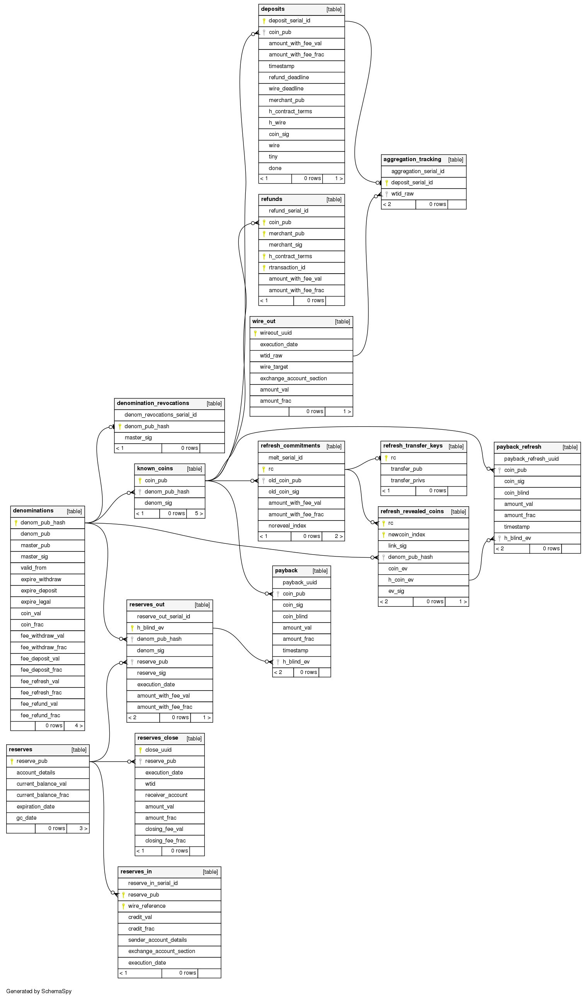

..
  This file is part of GNU TALER.

  Copyright (C) 2014-2020 Taler Systems SA

  TALER is free software; you can redistribute it and/or modify it under the
  terms of the GNU General Public License as published by the Free Software
  Foundation; either version 2.1, or (at your option) any later version.

  TALER is distributed in the hope that it will be useful, but WITHOUT ANY
  WARRANTY; without even the implied warranty of MERCHANTABILITY or FITNESS FOR
  A PARTICULAR PURPOSE.  See the GNU General Public License for more details.

  You should have received a copy of the GNU General Public License along with
  TALER; see the file COPYING.  If not, see <http://www.gnu.org/licenses/>

  @author Christian Grothoff

GNU Taler Exchange Operator Manual
##################################

Introduction
============

This manual is an early draft that still needs significant editing work
to become readable.

About GNU Taler
---------------

GNU Taler is an open protocol for an electronic payment system with a
free software reference implementation. GNU Taler offers secure, fast
and easy payment processing using well understood cryptographic
techniques. GNU Taler allows customers to remain anonymous, while
ensuring that merchants can be held accountable by governments. Hence,
GNU Taler is compatible with anti-money-laundering (AML) and
know-your-customer (KYC) regulation, as well as data protection
regulation (such as GDPR).

GNU Taler is not yet production-ready, after following this manual you
will have a backend that can process payments in “KUDOS”, but not
regular currencies. This is not so much because of limitations in the
backend, but because we are not aware of a Taler exchange operator
offering regular currencies today.

About this manual
-----------------

This tutorial targets system administrators who want to install and
operate a GNU Taler exchange.

Organizational prerequisites
----------------------------

Operating a GNU Taler exchange means that you are operating a payment
service provider, which means that you will most likely need a bank
license and/or follow applicable financial regulation.

GNU Taler payment service providers generally need to ensure high
availability and have *really* good backups (synchronous replication,
asynchronous remote replication, off-site backup, 24/7 monitoring,
etc.). [1]_ This manual will not cover these aspects of operating a
payment service provider.

We will assume that you can operate a (high-availability,
high-assurance) Postgres database. Furthermore, we expect some moderate
familiarity with the compilation and installation of free software
packages. You need to understand the cryptographic concepts of private
and public keys and must be able to protect private keys stored in files
on disk. An exchange uses an *offline* master key as well as *online*
keys. You are advised to secure your private master key and any copies
on encrypted, always-offline computers. Again, we assume that you are
familiar with good best practices in operational security, including
securing key material. [2]_

Architecture overview
---------------------

Taler is a pure payment system, not a new crypto-currency. As such, it
operates in a traditional banking context. In particular, this means
that in order to receive funds via Taler, the merchant must have a
regular bank account, and payments can be executed in ordinary
currencies such as USD or EUR. Similarly, the Taler exchange must
interact with a bank. The bank of the exchange holds the exchange’s
funds in an escrow account.

When customers wire money to the escrow account, the bank notifies the
exchange about the incoming wire transfers. The exchange then creates a
*reserve* based on the subject of the wire transfer. The wallet which
knows the secret key matching the wire transfer subject can then
withdraw coins from the reserve, thereby draining it. The liability of
the exchange against the reserve is thereby converted into a liability
against digital coins issued by the exchange. When the customer later
spends the coins at a merchant, and the merchant *deposits* the coins at
the exchange, the exchange first *aggregates* the amount from multiple
deposits from the same merchant and then instructs its bank to make a
wire transfer to the merchant, thereby fulfilling its obligation and
eliminating the liability. The exchange charges *fees* for some or all
of its operations to cover costs and possibly make a profit.

*Auditors* are third parties, for example financial regulators, that
verify that the exchange operates correctly. The same software is also
used to calculate the exchange’s profits, risk and liabilities by the
accountants of the exchange.

The Taler software stack for an exchange consists of the following
components:

-  HTTP frontend
   The HTTP frontend interacts with Taler wallets and merchant backends.
   It is used to withdraw coins, deposit coins, refresh coins, issue
   refunds, map wire transfers to Taler transactions, inquire about the
   exchange’s bank account details, signing keys and fee structure. The
   binary is the ``taler-exchange-httpd``.

-  Aggregator
   The aggregator combines multiple deposits made by the same merchant
   and (eventually) triggers wire transfers for the aggregate amount.
   The merchant can control how quickly wire transfers are made. The
   exchange may be charge a fee per wire transfer to discourage
   excessively frequent transfers. The binary is the
   ``taler-exchange-aggregator``.

-  Auditor
   The auditor verifies that the transactions performed by the exchange
   were done properly. It checks the various signatures, totals up the
   amounts and alerts the operator to any inconsistencies. It also
   computes the expected bank balance, revenue and risk exposure of the
   exchange operator. The main binary is the ``taler-auditor``.

-  Wire adapter
   A wire adapter is a component that enables exchange to talk to a bank.
   (1) The libtalerfakebank implements a bank with a wire adapter API
       inside of a testcase.
   (2) For the demonstration Web site (or local currencies),
       the Python bank provides a bank that directly provides
       the wire adapter API.
   (3) For production, libeufin's Nexus component implements a wire
       adapter towards the traditional SEPA banking system with IBAN
       accounts.
   The client-side wire adapter API is implemented in libtalerbank and
   is used by the aggregator to execute wire transfers and for the
   auditor to query bank transaction histories.

-  DBMS
   Postgres
   The exchange requires a DBMS to stores the transaction history for
   the Taler exchange and aggregator, and a (typically separate) DBMS
   for the Taler auditor. For now, the GNU Taler reference implemenation
   only supports Postgres, but the code could be easily extended to
   support another DBMS.

Installation
============

Please install the following packages before proceeding with the
exchange compilation.

-  GNU autoconf >= 2.69

-  GNU automake >= 1.14

-  GNU libtool >= 2.4

-  GNU autopoint >= 0.19

-  GNU libltdl >= 2.4

-  GNU libunistring >= 0.9.3

-  libcurl >= 7.26 (or libgnurl >= 7.26)

-  GNU libmicrohttpd >= 0.9.59

-  GNU libgcrypt >= 1.6

-  libjansson >= 2.7

-  Postgres >= 9.6, including libpq

-  libgnunetutil (from Git)

-  GNU Taler exchange (from Git)

Except for the last two, these are available in most GNU/Linux
distributions and should just be installed using the respective package
manager.

The following instructions will show how to install libgnunetutil and
the GNU Taler exchange.

Before you install libgnunetutil, you must download and install the
dependencies mentioned above, otherwise the build may succeed but fail
to export some of the tooling required by Taler.

To download and install libgnunetutil, proceed as follows:

::

   $ git clone https://git.gnunet.org/gnunet/
   $ cd gnunet/
   $ ./bootstrap
   $ ./configure [--prefix=GNUNETPFX]
   $ # Each dependency can be fetched from non standard locations via
   $ # the '--with-<LIBNAME>' option. See './configure --help'.
   $ make
   # make install

If you did not specify a prefix, GNUnet will install to ``/usr/local``,
which requires you to run the last step as ``root``.

To download and install the GNU Taler exchange, proceeds as follows:

::

   $ git clone git://git.taler.net/exchange
   $ cd exchange
   $ ./bootstrap
   $ ./configure [--prefix=EXCHANGEPFX] \
                 [--with-gnunet=GNUNETPFX]
   $ # Each dependency can be fetched from non standard locations via
   $ # the '--with-<LIBNAME>' option. See './configure --help'.
   $ make
   # make install

If you did not specify a prefix, the exchange will install to
``/usr/local``, which requires you to run the last step as ``root``.
Note that you have to specify ``--with-gnunet=/usr/local`` if you
installed GNUnet to ``/usr/local`` in the previous step.

Configuration
=============

This chapter provides an overview of the exchange configuration. Or at
least eventually will do so, for now it is a somewhat wild description
of some of the options.

Configuration format
--------------------

In Taler realm, any component obeys to the same pattern to get
configuration values. According to this pattern, once the component has
been installed, the installation deploys default values in
${prefix}/share/taler/config.d/, in .conf files. In order to override
these defaults, the user can write a custom .conf file and either pass
it to the component at execution time, or name it taler.conf and place
it under $HOME/.config/.

A config file is a text file containing sections, and each section
contains its values. The right format follows:

::

   [section1]
   value1 = string
   value2 = 23

   [section2]
   value21 = string
   value22 = /path22

Throughout any configuration file, it is possible to use ``$``-prefixed
variables, like ``$VAR``, especially when they represent filesystem
paths. It is also possible to provide defaults values for those
variables that are unset, by using the following syntax:
``${VAR:-default}``. However, there are two ways a user can set
``$``-prefixable variables:

by defining them under a ``[paths]`` section, see example below,

::

   [paths]
   TALER_DEPLOYMENT_SHARED = ${HOME}/shared-data
   ..
   [section-x]
   path-x = ${TALER_DEPLOYMENT_SHARED}/x

or by setting them in the environment:

::

   $ export VAR=/x

The configuration loader will give precedence to variables set under
``[path]``, though.

The utility ``taler-config``, which gets installed along with the
exchange, serves to get and set configuration values without directly
editing the .conf. The option ``-f`` is particularly useful to resolve
pathnames, when they use several levels of ``$``-expanded variables. See
``taler-config --help``.

Note that, in this stage of development, the file
``$HOME/.config/taler.conf`` can contain sections for *all* the
component. For example, both an exchange and a bank can read values from
it.

The repository ``git://taler.net/deployment`` contains examples of
configuration file used in our demos. See under ``deployment/config``.

   **Note**

   Expectably, some components will not work just by using default
   values, as their work is often interdependent. For example, a
   merchant needs to know an exchange URL, or a database name.

.. _Using-taler_002dconfig-exchange:

Using taler-config
------------------

The tool ``taler-config`` can be used to extract or manipulate
configuration values; however, the configuration use the well-known INI
file format and can also be edited by hand.

Run

::

   $ taler-config -s $SECTION

to list all of the configuration values in section ``$SECTION``.

Run

::

   $ taler-config -s $section -o $option

to extract the respective configuration value for option ``$option`` in
section ``$section``.

Finally, to change a setting, run

::

   $ taler-config -s $section -o $option -V $value

to set the respective configuration value to ``$value``. Note that you
have to manually restart the Taler backend after you change the
configuration to make the new configuration go into effect.

Some default options will use $-variables, such as ``$DATADIR`` within
their value. To expand the ``$DATADIR`` or other $-variables in the
configuration, pass the ``-f`` option to ``taler-config``. For example,
compare:

::

   $ taler-config -s ACCOUNT-bank \
                  -o WIRE_RESPONSE
   $ taler-config -f -s ACCOUNT-bank \
                  -o WIRE_RESPONSE

While the configuration file is typically located at
``$HOME/.config/taler.conf``, an alternative location can be specified
to ``taler-merchant-httpd`` and ``taler-config`` using the ``-c``
option.

.. _Keying:

Keying
------

The exchange works with three types of keys:

-  master key

-  sign keys

-  denomination keys (see section Coins)

-  MASTER_PRIV_FILE: Path to the exchange’s master private file.

-  MASTER_PUBLIC_KEY: Must specify the exchange’s master public key.

.. _Serving:

Serving
-------

The exchange can serve HTTP over both TCP and UNIX domain socket.

The following values are to be configured in the section [exchange]:

-  serve: must be set to tcp to serve HTTP over TCP, or unix to serve
   HTTP over a UNIX domain socket

-  port: Set to the TCP port to listen on if serve Is tcp.

-  unixpath: set to the UNIX domain socket path to listen on if serve Is
   unix

-  unixpath_mode: number giving the mode with the access permission MASK
   for the unixpath (i.e. 660 = rw-rw—-).

.. _Currency:

Currency
--------

The exchange supports only one currency. This data is set under the
respective option currency in section [taler].

.. _Bank-account:

Bank account
------------

To configure a bank account in Taler, we need to furnish four pieces of
information:

-  The ``payto://`` URL of the bank account, which uniquely idenfies the
   account. Examples for such URLs include
   ``payto://sepa/CH9300762011623852957`` for a bank account in the
   single European payment area (SEPA) or
   ``payto://x-taler-bank/localhost:8080/2`` for the 2nd bank account a
   the Taler bank demonstrator running at ``localhost`` on port 8080.
   The first part of the URL following ``payto://`` (“sepa” or
   “x-taler-bank”) is called the wire method.

-  A file containing the signed JSON-encoded bank account details for
   the /wire API. This is necessary as Taler supports offline signing
   for bank accounts for additional security.

-  Finally, the exchange needs to be provided resources for authentication
   to the respective banking service. The format in which the
   authentication information is currently a username and password
   for HTTP basic authentication, or nothing for the fakebank.

You can configure multiple accounts for an exchange by creating sections
starting with “account-” for the section name. You can ENABLE for each
account whether it should be used, and for what (incoming or outgoing
wire transfers):

::

   [account-1]
   URL = "payto://sepa/CH9300762011623852957"
   WIRE_RESPONSE = ${TALER_CONFIG_HOME}/account-1.json

   # Wire method supported for merchants, i.e. "IBAN" or
   # "x-taler-bank"
   METHOD = <method>

   # Use for exchange-aggregator (outgoing transfers)
   ENABLE_DEBIT = YES
   # Use for exchange-wirewatch (and listed in /wire)
   ENABLE_CREDIT = YES

   # Authentication options for exchange bank account go here.
   # (Next sections have examples of authentication mechanisms)
   TALER_BANK_AUTH_METHOD = basic
   USERNAME = exchange
   PASSWORD = super-secure

The command line tool taler-exchange-wire is used to create the
``account-1.json`` file. For example, the utility may be invoked as
follows to create all of the WIRE_RESPONSE files (in the locations
specified by the configuration):

::

   $ taler-exchange-wire

The generated file will be echoed by the exchange when serving
/wire [3]_ requests.

.. _Wire-fee-structure:

Wire fee structure
~~~~~~~~~~~~~~~~~~

.. meta::
  :keywords: wire fee
  :keywords: fee

For each wire method (“sepa” or “x-taler-wire”) the
exchange configuration must specify applicable wire fees. This is done
in configuration sections of the format ``fees-METHOD``. There are two
types of fees, simple wire fees and closing fees. Wire fees apply
whenever the aggregator transfers funds to a merchant. Closing fees
apply whenever the exchange closes a reserve (sending back funds to the
customer). The fees must be constant for a full year, which is specified
as part of the name of the option.

::

   [fees-iban]
   WIRE-FEE-2018 = EUR:0.01
   WIRE-FEE-2019 = EUR:0.01
   CLOSING-FEE-2018 = EUR:0.01
   CLOSING-FEE-2019 = EUR:0.01

   [fees-x-taler-bank]
   WIRE-FEE-2018 = KUDOS:0.01
   WIRE-FEE-2019 = KUDOS:0.01
   CLOSING-FEE-2018 = KUDOS:0.01
   CLOSING-FEE-2019 = KUDOS:0.01

.. _Database:

Database
--------

The option db under section [exchange] gets the DB backend’s name the
exchange is going to use. So far, only db = postgres is supported. After
choosing the backend, it is mandatory to supply the connection string
(namely, the database name). This is possible in two ways:

-  via an environment variable: TALER_EXCHANGEDB_POSTGRES_CONFIG.

-  via configuration option CONFIG, under section [exchangedb-BACKEND].
   For example, the demo exchange is configured as follows:

::

   [exchange]
   ...
   DB = postgres
   ...

   [exchangedb-postgres]
   CONFIG = postgres:///talerdemo

.. _Coins-denomination-keys:

Coins (denomination keys)
-------------------------

Sections specifying denomination (coin) information start with ``coin_``.
By convention, the name continues with "$CURRENCY_[$SUBUNIT]_$VALUE",
i.e. ``[coin_eur_ct_10]`` for a 10 cent piece. However, only the ``coin_``
prefix is mandatory. Each ``coin_``-section must then have the following
options:

-  value: How much is the coin worth, the format is
   CURRENCY:VALUE.FRACTION. For example, a 10 cent piece is "EUR:0.10".

-  duration_withdraw: How long can a coin of this type be withdrawn?
   This limits the losses incurred by the exchange when a denomination
   key is compromised.

-  duration_overlap: What is the overlap of the withdrawal timespan for
   this coin type?

-  duration_spend: How long is a coin of the given type valid? Smaller
   values result in lower storage costs for the exchange.

-  fee_withdraw: What does it cost to withdraw this coin? Specified
   using the same format as value.

-  fee_deposit: What does it cost to deposit this coin? Specified using
   the same format as value.

-  fee_refresh: What does it cost to refresh this coin? Specified using
   the same format as value.

-  rsa_keysize: How many bits should the RSA modulus (product of the two
   primes) have for this type of coin.

.. _Keys-duration:

Keys duration
-------------

Both signkeys and denom keys have a starting date. The option
lookahead_provide, under section [exchange], is such that only keys
whose starting date is younger than lookahead_provide will be issued by
the exchange.

signkeys. The option lookahead_sign is such that, being t the time when
taler-exchange-keyup is run, taler-exchange-keyup will generate n
signkeys, where t + (n \* signkey_duration) = t + lookahead_sign. In
other words, we generate a number of keys which is sufficient to cover a
period of lookahead_sign. As for the starting date, the first generated
key will get a starting time of t, and the j-th key will get a starting
time of x + signkey_duration, where x is the starting time of the
(j-1)-th key.

denom keys. The option lookahead_sign is such that, being t the time
when taler-exchange-keyup is run, taler-exchange-keyup will generate n
denom keys for each denomination, where t + (n \* duration_withdraw) = t
+ lookahead_sign. In other words, for each denomination, we generate a
number of keys which is sufficient to cover a period of lookahead_sign.
As for the starting date, the first generated key will get a starting
time of t, and the j-th key will get a starting time of x +
duration_withdraw, where x is the starting time of the (j-1)-th key.

To change these settings, edit the following values in section
[exchange]:

-  SIGNKEY_DURATION: How long should one signing key be used?

-  LOOKAHEAD_SIGN: How much time we want to cover with our signing keys?
   Note that if SIGNKEY_DURATION is bigger than LOOKAHEAD_SIGN,
   ``taler-exchange-keyup`` will generate a quantity of signing keys
   which is sufficient to cover all the gap.

Terms of Service
----------------

The exchange has an endpoint "/terms" to return the terms of service
(in legal language) of the exchange operator.  The wallet will show
those terms of service to the user when the user is first withdrawing
coins.  Terms of service are optional for experimental deployments,
if none are configured, the exchange will return a simple statement
saying that there are no terms of service available.

To configure the terms of service response, there are two options
in the [exchange] section:

-   TERMS_ETAG: The current "Etag" to return for the terms of service.
    This value must be changed whenever the terms of service are
    updated. A common value to use would be a version number.
    Note that if you change the TERMS_ETAG, you MUST also provide
    the respective files in TERMS_DIR (see below).
-   TERMS_DIR: The directory that contains the terms of service.
    The files in the directory must be readable to the exchange
    process.

The TERMS_DIR directory structure must follow a particular layout.
First, inside of TERMS_DIR, there should be sub-directories using
two-letter language codes like "en", "de", or "jp".  Each of these
directories would then hold translations of the current terms of
service into the respective language.  Empty directories are
permitted in case translations are not available.

Then, inside each language directory, files with the name of the
value set as the TERMS_ETAG must be provided. The extension of
each of the files should be typical for the respective mime type.
The set of supported mime types is currently hard-coded in the
exchange, and includes HTML, PDF and TXT files. If other files are
present, the exchange may show a warning on startup.

Example
~~~~~~~

A sample file structure for a TERMS_ETAG of "v1" would be:

-   TERMS_DIR/en/v1.txt
-   TERMS_DIR/en/v1.html
-   TERMS_DIR/en/v1.pdf
-   TERMS_DIR/de/v1.txt
-   TERMS_DIR/de/v1.html
-   TERMS_DIR/de/v1.pdf
-   TERMS_DIR/fr/v1.pdf

If the user requests an HTML with language preferences "fr" followed by "en",
the exchange would return "TERMS_DIR/en/v1.html" lacking an HTML version in
French.

.. _Deployment:

Deployment
==========

This chapter describes how to deploy the exchange once it has been
properly configured.

.. _Keys-generation:

Keys generation
---------------

Once the configuration is properly set up, all the keys can be generated
by the tool ``taler-exchange-keyup``. The following command generates
denomkeys and signkeys, plus the "blob" that is to be signed by the
auditor.

::

   taler-exchange-keyup -o blob

*blob* contains data about denomkeys that the exchange operator needs to
get signed by every auditor he wishes (or is forced to) work with.

In a normal scenario, an auditor must have some way of receiving the
blob to sign (Website, manual delivery, ..). Nonetheless, the exchange
admin can fake an auditor signature — for testing purposes — by running
the following command

::

   taler-auditor-sign -m EXCHANGE_MASTER_PUB -r BLOB -u AUDITOR_URL -o OUTPUT_FILE

Those arguments are all mandatory.

-  ``EXCHANGE_MASTER_PUB`` the base32 Crockford-encoded exchange’s
   master public key. Tipically, this value lies in the configuration
   option ``[exchange]/master_public_key``.

-  ``BLOB`` the blob generated in the previous step.

-  ``AUDITOR_URL`` the URL that identifies the auditor.

-  ``OUTPUT_FILE`` where on the disk the signed blob is to be saved.

``OUTPUT_FILE`` must then be copied into the directory specified by the
option ``AUDITOR_BASE_DIR`` under the section ``[exchangedb]``. Assuming
``AUDITOR_BASE_DIR = ${HOME}/.local/share/taler/auditors``, the
following command will "add" the auditor identified by ``AUDITOR_URL``
to the exchange.

::

   cp OUTPUT_FILE ${HOME}/.local/share/taler/auditors

If the auditor has been correctly added, the exchange’s ``/keys``
response must contain an entry in the ``auditors`` array mentioning the
auditor’s URL.

.. _Database-upgrades:

Database upgrades
-----------------

Currently, there is no way to upgrade the database between Taler
versions.

The exchange database can be re-initialized using:

::

   $ taler-exchange-dbinit -r

However, running this command will result in all data in the database
being lost, which may result in significant financial liabilities as the
exchange can then not detect double-spending. Hence this operation must
not be performed in a production system.

.. _Diagnostics:

Diagnostics
===========

This chapter includes various (very unpolished) sections on specific
topics that might be helpful to understand how the exchange operates,
which files should be backed up. The information may also be helpful for
diagnostics.

.. _Reserve-management:

Reserve management
------------------

Incoming transactions to the exchange’s provider result in the creation
or update of reserves, identified by their reserve key. The command line
tool taler-exchange-reservemod allows create and add money to reserves
in the exchange’s database.

.. _Database-Scheme:

Database Scheme
---------------

The exchange database must be initialized using taler-exchange-dbinit.
This tool creates the tables required by the Taler exchange to operate.
The tool also allows you to reset the Taler exchange database, which is
useful for test cases but should never be used in production. Finally,
taler-exchange-dbinit has a function to garbage collect a database,
allowing administrators to purge records that are no longer required.

The database scheme used by the exchange look as follows:

.. _Signing-key-storage:

Signing key storage
-------------------

The private online signing keys of the exchange are stored in a
subdirectory "signkeys/" of the "KEYDIR" which is an option in the
"[exchange]" section of the configuration file. The filename is the
starting time at which the signing key can be used in microseconds since
the Epoch. The file format is defined by the struct
TALER_EXCHANGEDB_PrivateSigningKeyInformationP:

::

   struct TALER_EXCHANGEDB_PrivateSigningKeyInformationP {
      struct TALER_ExchangePrivateKeyP signkey_priv;
      struct TALER_ExchangeSigningKeyValidityPS issue;
   };

.. _Denomination-key-storage:

Denomination key storage
------------------------

The private denomination keys of the exchange are store in a
subdirectory "denomkeys/" of the "KEYDIR" which is an option in the
"[exchange]" section of the configuration file. "denomkeys/" contains
further subdirectories, one per denomination. The specific name of the
subdirectory under "denomkeys/" is ignored by the exchange. However, the
name is important for the "taler-exchange-keyup" tool that generates the
keys. The tool combines a human-readable encoding of the denomination
(i.e. for EUR:1.50 the prefix would be "EUR_1_5-", or for EUR:0.01 the
name would be "EUR_0_01-") with a postfix that is a truncated
Crockford32 encoded hash of the various attributes of the denomination
key (relative validity periods, fee structure and key size). Thus, if
any attributes of a coin change, the name of the subdirectory will also
change, even if the denomination remains the same.

Within this subdirectory, each file represents a particular denomination
key. The filename is the starting time at which the signing key can be
used in microseconds since the Epoch. The format on disk begins with a
struct TALER_EXCHANGEDB_DenominationKeyInformationP giving the
attributes of the denomination key and the associated signature with the
exchange’s long-term offline key:

::

   struct TALER_EXCHANGEDB_DenominationKeyInformationP {
     struct TALER_MasterSignatureP signature;
     struct TALER_DenominationKeyValidityPS properties;
   };

This is then followed by the variable-size RSA private key in
libgcrypt’s S-expression format, which can be decoded using
GNUNET_CRYPTO_rsa_private_key_decode().

.. _Revocations:

Revocations
~~~~~~~~~~~

When an exchange goes out of business or detects that the private key of
a denomination key pair has been compromised, it may revoke some or all
of its denomination keys. At this point, the hashes of the revoked keys
must be returned as part of the ``/keys`` response under “payback”.
Wallets detect this, and then return unspent coins of the respective
denomination key using the ``/payback`` API.

When a denomination key is revoked, a revocation file is placed into the
respective subdirectory of “denomkeys/”. The file has the same prefix as
the file that stores the struct
TALER_EXCHANGEDB_DenominationKeyInformationP information, but is
followed by the “.rev” suffix. It contains a 64-byte EdDSA signature
made with the master key of the exchange with purpose
``TALER_SIGNATURE_MASTER_DENOMINATION_KEY_REVOKED``. If such a file is
present, the exchange must check the signature and if it is valid treat
the respective denomination key as revoked.

Revocation files can be generated using the ``taler-exchange-keyup``
command-line tool using the ``-r`` option. The Taler auditor will
instruct operators to generate revocations if it detects a key
compromise (which is possible more coins of a particular denomination
were deposited than issued).

It should be noted that denomination key revocations should only happen
under highly unusual (“emergency”) conditions and not under normal
conditions.

.. _Auditor-signature-storage:

Auditor signature storage
-------------------------

Signatures from auditors are stored in the directory specified in the
exchange configuration section "exchangedb" under the option
"AUDITOR_BASE_DIR". The exchange does not care about the specific names
of the files in this directory.

Each file must contain a header with the public key information of the
auditor, the master public key of the exchange, and the number of signed
denomination keys:

::

   struct AuditorFileHeaderP {
     struct TALER_AuditorPublicKeyP apub;
     struct TALER_MasterPublicKeyP mpub;
     uint32_t dki_len;
   };

This is then followed by dki_len signatures of the auditor of type
struct TALER_AuditorSignatureP, which are then followed by another
dki_len blocks of type struct TALER_DenominationKeyValidityPS. The
auditor’s signatures must be signatures over the information of the
corresponding denomination key validity structures embedded in a struct
TALER_ExchangeKeyValidityPS structure using the
TALER_SIGNATURE_AUDITOR_EXCHANGE_KEYS purpose.

.. [1]
   Naturally, you could operate a Taler exchange for a toy currency
   without any real value on low-cost setups like a Raspberry Pi, but we
   urge you to limit the use of such setups to research and education as
   with GNU Taler data loss instantly results in financial losses.

.. [2]
   The current implementation does not make provisions for secret
   splitting. Still, the use of a hardware security module (HSM) for
   protecting private keys is adviseable, so please contact the
   developers for HSM integration support.

.. [3]
   https://api.taler.net/api-exchange.html#wire-req
