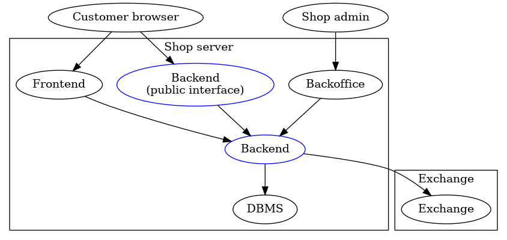

The GNU Taler Merchant API Tutorial
###################################

Introduction
============

About GNU Taler
---------------

GNU Taler is an open protocol for an electronic payment system with a
free software reference implementation. GNU Taler offers secure, fast
and easy payment processing using well understood cryptographic
techniques. GNU Taler allows customers to remain anonymous, while
ensuring that merchants can be held accountable by governments. Hence,
GNU Taler is compatible with anti-money-laundering (AML) and
know-your-customer (KYC) regulation, as well as data protection
regulation (such as GDPR).

About this tutorial
-------------------

This tutorial addresses how to process payments using the GNU Taler
merchant Backend. This chapter explains some basic concepts. In the
second chapter, you will learn how to do basic payments.

This version of the tutorial has examples for Python3. It uses the
requests library for HTTP requests. Versions for other
languages/environments are available as well.

examples
git
If you want to look at some simple, running examples, check out these:

-  The `essay
   merchant <https://git.taler.net/blog.git/tree/talerblog/blog/blog.py>`__
   that sells single chapters of a book.

-  The `donation
   page <https://git.taler.net/donations.git/tree/talerdonations/donations/donations.py>`__
   that accepts donations for software projects and gives donation
   receipts.

-  The
   `survey <https://git.taler.net/survey.git/tree/talersurvey/survey/survey.py>`__
   that gives users who answer a question a small reward.

Architecture overview
---------------------

The Taler software stack for a merchant consists of the following main
components:

-  frontend
   A frontend which interacts with the customer’s browser. The frontend
   enables the customer to build a shopping cart and place an order.
   Upon payment, it triggers the respective business logic to satisfy
   the order. This component is not included with Taler, but rather
   assumed to exist at the merchant. This tutorial describes how to
   develop a Taler frontend.

-  backend
   A Taler-specific payment backend which makes it easy for the frontend
   to process financial transactions with Taler. For this tutorial, you
   will use a public sandbox backend. For production use, you must
   either set up your own backend or ask another person to do so for
   you.

The following image illustrates the various interactions of these key
components:

|image0|

The backend provides the cryptographic protocol support, stores
Taler-specific financial information and communicates with the GNU Taler
exchange over the Internet. The frontend accesses the backend via a
RESTful API. As a result, the frontend never has to directly communicate
with the exchange, and also does not deal with sensitive data. In
particular, the merchant’s signing keys and bank account information are
encapsulated within the Taler backend.

Some functionality of the backend (the “public interface“) is also
exposed to the customer’s browser directly. In the HTTP API, all public
endpoints are prefixed with ``/public/``.

Public Sandbox Backend and Authentication
-----------------------------------------

sandbox
authorization
How the frontend authenticates to the Taler backend depends on the
configuration. See Taler Merchant Operating Manual.

The public sandbox backend https://backend.demo.taler.net/ uses an API
key in the ``Authorization`` header. The value of this header must be
``ApiKey sandbox`` for the public sandbox backend.

::

   >>> import requests
   >>> requests.get("https://backend.demo.taler.net",
   ...              headers={"Authorization": "ApiKey sandbox"})
   <Response [200]>

If an HTTP status code other than 200 is returned, something went wrong.
You should figure out what the problem is before continuing with this
tutorial.

The sandbox backend https://backend.demo.taler.net/ uses ``KUDOS`` as an
imaginary currency. Coins denominated in ``KUDOS`` can be withdrawn from
https://bank.demo.taler.net/.

Merchant Instances
------------------

instance
The same Taler merchant backend server can be used by multiple separate
merchants that are separate business entities. Each of these separate
business entities is called a *merchant instance*, and is identified by
an alphanumeric *instance id*. If the instance is omitted, the instance
id ``default`` is assumed.

The following merchant instances are configured on
https://backend.demo.taler.net/:

-  ``GNUnet`` (The GNUnet project)

-  ``FSF`` (The Free Software Foundation)

-  ``Tor`` (The Tor Project)

-  ``default`` (Kudos Inc.)

Note that these are fictional merchants used for our demonstrators and
not affiliated with or officially approved by the respective projects.

.. _Accepting-a-Simple-Payment:

Accepting a Simple Payment
==========================

Creating an Order for a Payment
-------------------------------

order
Payments in Taler revolve around an *order*, which is a machine-readable
description of the business transaction for which the payment is to be
made. Before accepting a Taler payment as a merchant you must create
such an order.

This is done by posting a JSON object to the backend’s ``/order`` API
endpoint. At least the following fields must be given:

-  amount: The amount to be paid, as a string in the format
   ``CURRENCY:DECIMAL_VALUE``, for example ``EUR:10`` for 10 Euros or
   ``KUDOS:1.5`` for 1.5 KUDOS.

-  summary: A human-readable summary for what the payment is about. The
   summary should be short enough to fit into titles, though no hard
   limit is enforced.

-  fulfillment_url: A URL that will be displayed once the payment is
   completed. For digital goods, this should be a page that displays the
   product that was purchased. On successful payment, the wallet
   automatically appends the ``order_id`` as a query parameter, as well
   as the ``session_sig`` for session-bound payments (discussed later).

Orders can have many more fields, see `The Taler Order
Format <#The-Taler-Order-Format>`__.

After successfully ``POST``\ ing to ``/order``, an ``order_id`` will be
returned. Together with the merchant ``instance``, the order id uniquely
identifies the order within a merchant backend.

::

   >>> import requests
   >>> order = dict(order=dict(amount="KUDOS:10",
   ...                         summary="Donation",
   ...                         fulfillment_url="https://example.com/thanks.html"))
   >>> order_resp = requests.post("https://backend.demo.taler.net/order", json=order,
   ...               headers={"Authorization": "ApiKey sandbox"})
   <Response [200]>

The backend will fill in some details missing in the order, such as the
address of the merchant instance. The full details are called the
*contract terms*. contract terms

Checking Payment Status and Prompting for Payment
-------------------------------------------------

The status of a payment can be checked with the ``/check-payment``
endpoint. If the payment is yet to be completed by the customer,
``/check-payment`` will give the frontend a URL (the
payment_redirect_url) that will trigger the customer’s wallet to execute
the payment.

Note that the only way to obtain the payment_redirect_url is to check
the status of the payment, even if you know that the user did not pay
yet.

::

   >>> import requests
   >>> r = requests.get("https://backend.demo.taler.net/check-payment",
   ...                  params=dict(order_id=order_resp.json()["order_id"]),
   ...                  headers={"Authorization": "ApiKey sandbox"})
   >>> print(r.json())

If the paid field in the response is ``true``, the other fields in the
response will be different. Once the payment was completed by the user,
the response will contain the following fields:

-  paid: Set to true.

-  contract_terms: The full contract terms of the order.

-  refunded: ``true`` if a (possibly partial) refund was granted for
   this purchase.

-  refunded_amount: Amount that was refunded

-  last_session_id: Last session ID used by the customer’s wallet. See
   `Session-Bound Payments <#Session_002dBound-Payments>`__.

Once the frontend has confirmed that the payment was successful, it
usually needs to trigger the business logic for the merchant to fulfill
the merchant’s obligations under the contract.

.. _Giving-Refunds:

Giving Refunds
==============

refunds
A refund in GNU Taler is a way to “undo” a payment. It needs to be
authorized by the merchant. Refunds can be for any fraction of the
original amount paid, but they cannot exceed the original payment.
Refunds are time-limited and can only happen while the exchange holds
funds for a particular payment in escrow. The time during which a refund
is possible can be controlled by setting the ``refund_deadline`` in an
order. The default value for this refund deadline is specified in the
configuration of the merchant’s backend.

The frontend can instruct the merchant backend to authorize a refund by
``POST``\ ing to the ``/refund`` endpoint.

The refund request JSON object has the following fields:

-  order_id: Identifies for which order a customer should be refunded.

-  instance: Merchant instance to use.

-  refund: Amount to be refunded. If a previous refund was authorized
   for the same order, the new amount must be higher, otherwise the
   operation has no effect. The value indicates the total amount to be
   refunded, *not* an increase in the refund.

-  reason: Human-readable justification for the refund. The reason is
   only used by the Back Office and is not exposed to the customer.

If the request is successful (indicated by HTTP status code 200), the
response includes a ``refund_redirect_url``. The frontend must redirect
the customer’s browser to that URL to allow the refund to be processed
by the wallet.

This code snipped illustrates giving a refund:

::

   >>> import requests
   >>> refund_req = dict(order_id="2018.058.21.46.06-024C85K189H8P",
   ...                   refund="KUDOS:10",
   ...                   instance="default",
   ...                   reason="Customer did not like the product")
   >>> requests.post("https://backend.demo.taler.net/refund", json=refund_req,
   ...              headers={"Authorization": "ApiKey sandbox"})
   <Response [200]>

.. _Giving-Customers-Tips:

Giving Customers Tips
=====================

tips
GNU Taler allows Web sites to grant small amounts directly to the
visitor. The idea is that some sites may want incentivize actions such
as filling out a survey or trying a new feature. It is important to note
that tips are not enforceable for the visitor, as there is no contract.
It is simply a voluntary gesture of appreciation of the site to its
visitor. However, once a tip has been granted, the visitor obtains full
control over the funds provided by the site.

The “merchant” backend of the site must be properly configured for
tipping, and sufficient funds must be made available for tipping See
Taler Merchant Operating Manual.

To check if tipping is configured properly and if there are sufficient
funds available for tipping, query the ``/tip-query`` endpoint:

::

   >>> import requests
   >>> requests.get("https://backend.demo.taler.net/tip-query?instance=default",
   ...              headers={"Authorization": "ApiKey sandbox"})
   <Response [200]>

authorize tip
To authorize a tip, ``POST`` to ``/tip-authorize``. The following fields
are recognized in the JSON request object:

-  amount: Amount that should be given to the visitor as a tip.

-  instance: Merchant instance that grants the tip (each instance may
   have its own independend tipping funds configured).

-  justification: Description of why the tip was granted. Human-readable
   text not exposed to the customer, but used by the Back Office.

-  next_url: The URL that the user’s browser should be redirected to by
   the wallet, once the tip has been processed.

The response from the backend contains a ``tip_redirect_url``. The
customer’s browser must be redirected to this URL for the wallet to pick
up the tip. pick up tip

This code snipped illustrates giving a tip:

::

   >>> import requests
   >>> tip_req = dict(amount="KUDOS:0.5",
   ...                instance="default",
   ...                justification="User filled out survey",
   ...                next_url="https://merchant.com/thanks.html")
   >>> requests.post("https://backend.demo.taler.net/tip-authorize", json=tip_req,
   ...              headers={"Authorization": "ApiKey sandbox"})
   <Response [200]>

.. _Advanced-topics:

Advanced topics
===============

.. _Detecting-the-Presence-of-the-Taler-Wallet:

Detecting the Presence of the Taler Wallet
------------------------------------------

wallet
Taler offers ways to detect whether a user has the wallet installed in
their browser. This allows Web sites to adapt accordingly. Note that not
all platforms can do presence detection reliably. Some platforms might
have a Taler wallet installed as a separate App instead of using a Web
extension. In these cases, presence detection will fail. Thus, sites may
want to allow users to request Taler payments even if a wallet could not
be detected, especially for visitors using mobiles.

Presence detection without JavaScript
~~~~~~~~~~~~~~~~~~~~~~~~~~~~~~~~~~~~~

Presence detection without JavaScript is based on CSS classes. You can
hide or show elements selectively depending on whether the wallet is
detected or not.

In order to work correctly, a special fallback stylesheet must be
included that will be used when the wallet is not present. The
stylesheet can be put into any file, but must be included via a ``link``
tag with the ``id`` attribute set to ``taler-presence-stylesheet``. If a
wallet is present, it will “hijack” this stylesheet to change how
elements with the following classes are rendered:

The following CSS classes can be used:

``taler-installed-hide``
   A CSS rule will set the ``display`` property for this class to
   ``none`` once the Taler wallet is installed and enabled. If the
   wallet is not installed, ``display`` will be ``inherit``.

``taler-installed-show``
   A CSS rule will set the ``display`` property for this class to
   ``inherit`` once the Taler wallet is installed and enabled. If the
   wallet is not installed, ``display`` will be ``none``.

The following is a complete example:

::

   <!DOCTYPE html>
   <html data-taler-nojs="true">
     <head>
       <title>Tutorial</title>
       <link rel="stylesheet"
             type="text/css"
             href="/web-common/taler-fallback.css"
             id="taler-presence-stylesheet" />
     </head>
     <body>
       

         No wallet found.
       

       

         Wallet found!
       

     </body>
   </html>

The ``taler-fallback.css`` is part of the Taler’s *web-common*
repository, available at
https://git.taler.net/web-common.git/tree/taler-fallback.css. You may
have to adjust the ``href`` attribute in the HTML code above to point to
the correct location of the ``taler-fallback.css`` file on your Web
site.

Detection with JavaScript
~~~~~~~~~~~~~~~~~~~~~~~~~

The following functions are defined in the ``taler`` namespace of the
``taler-wallet-lib`` helper library available at
https://git.taler.net/web-common.git/tree/taler-wallet-lib.js.

``onPresent(callback: () => void)``
   Adds a callback to be called when support for Taler payments is
   detected.

``onAbsent(callback: () => void)``
   Adds a callback to be called when support for Taler payments is
   disabled.

Note that the registered callbacks may be called more than once. This
may happen if a user disables or enables the wallet in the browser’s
extension settings while a shop’s frontend page is open.

.. _Integration-with-the-Back-Office:

Integration with the Back Office
--------------------------------

Taler ships a Back Office application as a stand-alone Web application.
The Back Office has its own documentation at
https://docs.taler.net/backoffice/html/manual.html.

Developers wishing to tightly integrate back office support for
Taler-based payments into an existing back office application should
focus on the wire transfer tracking and transaction history sections of
the Taler Backend API specification at
https://docs.taler.net/api/api-merchant.html

.. _Session_002dBound-Payments:

Session-Bound Payments
----------------------

session
Sometimes checking if an order has been paid for is not enough. For
example, when selling access to online media, the publisher may want to
be paid for exactly the same product by each customer. Taler supports
this model by allowing the mechant to check whether the “payment
receipt” is available on the user’s current device. This prevents users
from easily sharing media access by transmitting a link to the
fulfillment page. Of course sophisticated users could share payment
receipts as well, but this is not as easy as sharing a link, and in this
case they are more likely to just share the media directly.

To use this feature, the merchant must first assign the user’s current
browser an ephemeral ``session_id``, usually via a session cookie. When
executing or re-playing a payment, the wallet will receive an additional
signature (``session_sig``). This signature certifies that the wallet
showed a payment receipt for the respective order in the current
session. cookie

Session-bound payments are triggerd by passing the ``session_id``
parameter to the ``/check-payment`` endpoint. The wallet will then
redirect to the fulfillment page, but include an additional
``session_sig`` parameter. The frontend can query ``/check-payment``
with both the ``session_id`` and the ``session_sig`` to verify that the
signature is correct.

The last session ID that was successfuly used to prove that the payment
receipt is in the user’s wallet is also available as ``last_session_id``
in the response to ``/check-payment``.

.. _Product-Identification:

Product Identification
----------------------

resource url
In some situations the user may have paid for some digital good, but the
frontend does not know the exact order ID, and thus cannot instruct the
wallet to reveil the existing payment receipt. This is common for simple
shops without a login system. In this case, the user would be prompted
for payment again, even though they already purchased the product.

To allow the wallet to instead find the existing payment receipt, the
shop must use a unique fulfillment URL for each product. Then, the
frontend must provide an additional ``resource_url`` parameter to to
``/check-payment``. It should identify this unique fulfillment URL for
the product. The wallet will then check whether it has paid for a
contract with the same ``resource_url`` before, and if so replay the
previous payment.

.. _The-Taler-Order-Format:

The Taler Order Format
----------------------

contract
terms
order
A Taler order can specify many details about the payment. This section
describes each of the fields in depth.

Financial amounts are always specified as a string in the format
``"CURRENCY:DECIMAL_VALUE"``.

amount
   amount
   Specifies the total amount to be paid to the merchant by the
   customer.

max_fee
   fees
   maximum deposit fee
   This is the maximum total amount of deposit fees that the merchant is
   willing to pay. If the deposit fees for the coins exceed this amount,
   the customer has to include it in the payment total. The fee is
   specified using the same triplet used for amount.

max_wire_fee
   fees
   maximum wire fee
   Maximum wire fee accepted by the merchant (customer share to be
   divided by the ’wire_fee_amortization’ factor, and further reduced if
   deposit fees are below ’max_fee’). Default if missing is zero.

wire_fee_amortization
   fees
   maximum fee amortization
   Over how many customer transactions does the merchant expect to
   amortize wire fees on average? If the exchange’s wire fee is above
   ’max_wire_fee’, the difference is divided by this number to compute
   the expected customer’s contribution to the wire fee. The customer’s
   contribution may further be reduced by the difference between the
   ’max_fee’ and the sum of the actual deposit fees. Optional, default
   value if missing is 1. 0 and negative values are invalid and also
   interpreted as 1.

pay_url
   pay_url
   Which URL accepts payments. This is the URL where the wallet will
   POST coins.

fulfillment_url
   fulfillment URL
   Which URL should the wallet go to for obtaining the fulfillment, for
   example the HTML or PDF of an article that was bought, or an order
   tracking system for shipments, or a simple human-readable Web page
   indicating the status of the contract.

order_id
   order ID
   Alphanumeric identifier, freely definable by the merchant. Used by
   the merchant to uniquely identify the transaction.

summary
   summary
   Short, human-readable summary of the contract. To be used when
   displaying the contract in just one line, for example in the
   transaction history of the customer.

timestamp
   Time at which the offer was generated.

pay_deadline
   payment deadline
   Timestamp of the time by which the merchant wants the exchange to
   definitively wire the money due from this contract. Once this
   deadline expires, the exchange will aggregate all deposits where the
   contracts are past the refund_deadline and execute one large wire
   payment for them. Amounts will be rounded down to the wire transfer
   unit; if the total amount is still below the wire transfer unit, it
   will not be disbursed.

refund_deadline
   refund deadline
   Timestamp until which the merchant willing (and able) to give refunds
   for the contract using Taler. Note that the Taler exchange will hold
   the payment in escrow at least until this deadline. Until this time,
   the merchant will be able to sign a message to trigger a refund to
   the customer. After this time, it will no longer be possible to
   refund the customer. Must be smaller than the pay_deadline.

products
   product description
   Array of products that are being sold to the customer. Each entry
   contains a tuple with the following values:

   description
      Description of the product.

   quantity
      Quantity of the items to be shipped. May specify a unit (``1 kg``)
      or just the count.

   price
      Price for quantity units of this product shipped to the given
      delivery_location. Note that usually the sum of all of the prices
      should add up to the total amount of the contract, but it may be
      different due to discounts or because individual prices are
      unavailable.

   product_id
      Unique ID of the product in the merchant’s catalog. Can generally
      be chosen freely as it only has meaning for the merchant, but
      should be a number in the range :math:`[0,2^{51})`.

   taxes
      Map of applicable taxes to be paid by the merchant. The label is
      the name of the tax, i.e. VAT, sales tax or income tax, and the
      value is the applicable tax amount. Note that arbitrary labels are
      permitted, as long as they are used to identify the applicable tax
      regime. Details may be specified by the regulator. This is used to
      declare to the customer which taxes the merchant intends to pay,
      and can be used by the customer as a receipt. The information is
      also likely to be used by tax audits of the merchant.

   delivery_date
      Time by which the product is to be delivered to the
      delivery_location.

   delivery_location
      This should give a label in the locations map, specifying where
      the item is to be delivered.

   Values can be omitted if they are not applicable. For example, if a
   purchase is about a bundle of products that have no individual prices
   or product IDs, the product_id or price may not be specified in the
   contract. Similarly, for virtual products delivered directly via the
   fulfillment URI, there is no delivery location.

merchant
   address
      This should give a label in the locations map, specifying where
      the merchant is located.

   name
      This should give a human-readable name for the merchant’s
      business.

   jurisdiction
      This should give a label in the locations map, specifying the
      jurisdiction under which this contract is to be arbitrated.

locations
   location
   Associative map of locations used in the contract. Labels for
   locations in this map can be freely chosen and used whenever a
   location is required in other parts of the contract. This way, if the
   same location is required many times (such as the business address of
   the customer or the merchant), it only needs to be listed (and
   transmitted) once, and can otherwise be referred to via the label. A
   non-exhaustive list of location attributes is the following:

   country
      Name of the country for delivery, as found on a postal package,
      i.e. “France”.

   state
      Name of the state for delivery, as found on a postal package, i.e.
      “NY”.

   region
      Name of the region for delivery, as found on a postal package.

   province
      Name of the province for delivery, as found on a postal package.

   city
      Name of the city for delivery, as found on a postal package.

   ZIP code
      ZIP code for delivery, as found on a postal package.

   street
      Street name for delivery, as found on a postal package.

   street number
      Street number (number of the house) for delivery, as found on a
      postal package.

   name receiver name for delivery, either business or person name.

   Note that locations are not required to specify all of these fields,
   and they is also allowed to have additional fields. Contract
   renderers must render at least the fields listed above, and should
   render fields that they do not understand as a key-value list.

